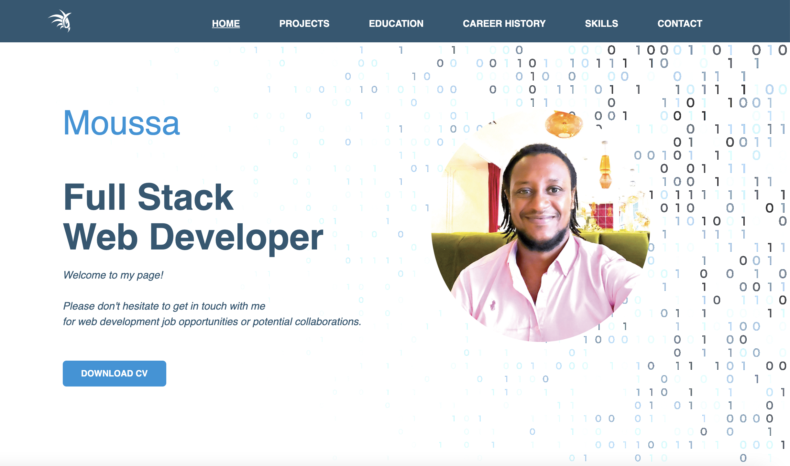
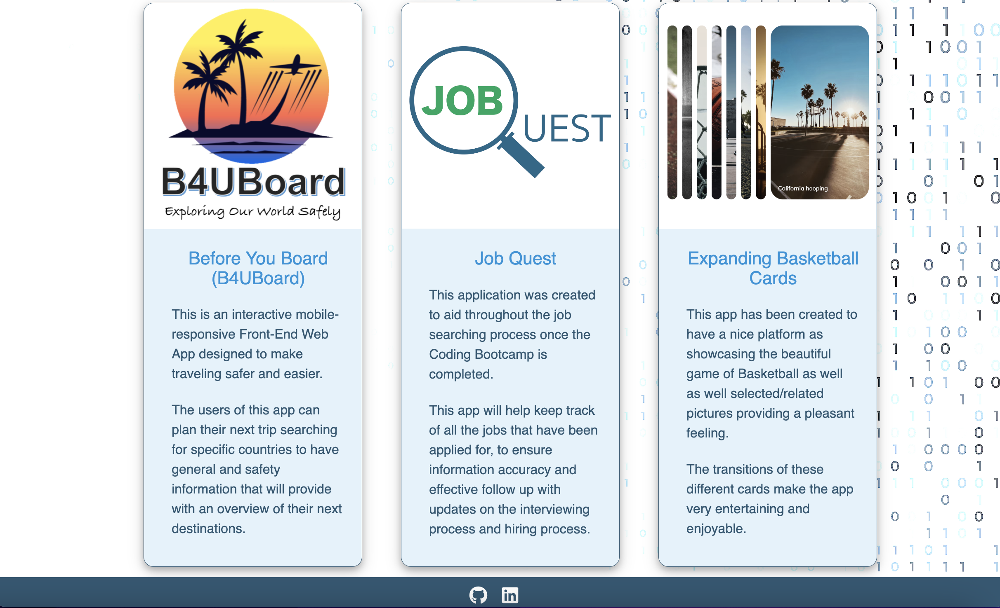
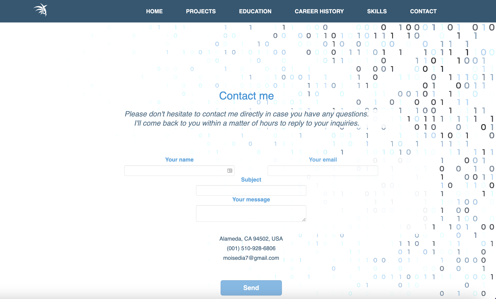

# MD_Portfolio

#### MD Portfolio [TheAnswer07](https://github.com/TheAnswer07)

#### MD_Portfolio

## Table of Contents:
* [Project Description](#project-description)
* [User Story](#username)
* [Credits](#credits)
* [Contribution](#contribution)
* [GitHub Profile Link](#github-profile-link)
* [Repositories Links](#repositories-links)
* [Portfolio Link (initial version)](#portfolio-link-initial-version)
* [Current Portfolio Link](#current-portfolio-link)
* [Screenshots:](#screenshots)
    1. [Screenshot 1](#Screenshot-1)
    2. [Screenshot 2](#Screenshot-2)

### Project Description:

This portfolio is the latest version of its kind. It has been created with React in order to highlight my professional profile in the best of ways possible. I hope you like it!

### User Story:

AS AN employer looking for candidates with experience building single-page applications
I WANT to view a potential employee's deployed React portfolio of work samples
SO THAT I can assess whether they're a good candidate for an open position

### Credits:

Big shout out to Scott Nelson from UCB Extension for helping me taylor my code for this project in the best of ways possible.

### Contribution:

You can contribute to this project by accessing my GitHub page.

### GitHub Profile Link:

[GitHub Profile Link](https://github.com/TheAnswer07)

### Repositories Links:

- Original portfolio repository with major commits: [Original portfolio's repository with major commits](https://github.com/TheAnswer07/portfoliomoussadia)

- Latest repository for cloned portfolio: [Latest repository for cloned portfolio](https://github.com/TheAnswer07/moussadiaportfolio)

### Portfolio Link:

[Portfolio Link](https://)

### Screenshots:

1. Home Page:

2. Projects Page With Footer:

3. Contact Page:

